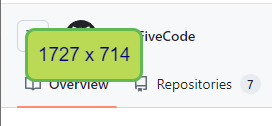

# BrowserRuler
Chrome browser extension to show browser window size.

For example:

## Motivation
This browser extension is not ground breaking. The motivation for writing this is to learn about Chrome browser extensions and developing in javascript, html and css. It's a passion project.

## Technical
Chrome browser extension written in javascript.

## Security considerations
TBA.

## Author and License
RedFiveCode (https://github.com/RedFiveCode)

Copyright (c) 2024 RedFiveCode (https://github.com/RedFiveCode) All rights reserved.

Released under MIT License (see License.txt file).

## Third party components
Thanks for the following:
* [FontAwesome](https://github.com/FortAwesome/Font-Awesome) ([CC 4.0](https://fontawesome.com/license/free))
* [Pickr Color-Pickr library](https://github.com/simonwep/pickr) ([MIT](https://github.com/simonwep/pickr?tab=MIT-1-ov-file#readme))

## Warranty
The author(s) accept no liability or responsibility for any data loss or corruption or damage to sensor tags caused by the use of this application or libraries.
Use of this software is entirely at your own risk; please ensure that you have adequate backups before you use this software.

See License.txt file.
